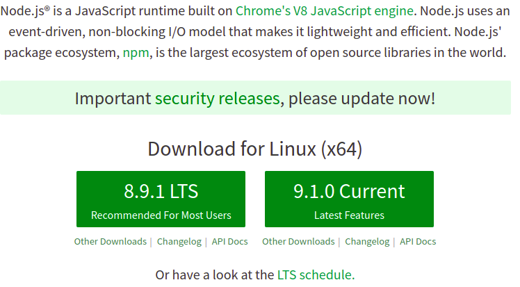

<!--
$theme: gaia
template: gaia
-->


Node.js基础
二、安装<p style="text-align:right;font-size:28px;margin-right:50px;color:#cFc;">:star: by calidion</p>
===
---

安装方式
===
1. 直接下载官方的包
优点：简单，方式
缺点：不方便测试，开发

2. 使用nvm等版本管理器
优点：可以管理多个版本的node.js，方便测试，开发
缺点：学习成本相对比较高，安装相对复杂

---
下载官方包安装
===
访问Node.js官网:
[https://nodejs.org/](https://nodejs.org/)


---
两种版本
===
1. LTS： Long Term Support
适合追求稳定，一般的生产环境

2. Current: 当前的最新版本
适合追求新功能，尝试新功能的版本

---
多版本共存安装
===
### nvm (Node version manager)

1. 适合Unix平台(Linux, Mac OS, BSD, 其它Unix版本）

2. 安装
```
curl -o- https://raw.githubusercontent.com/creationix/nvm/v0.31.1/install.sh | bash
# 或者
wget -qO- https://raw.githubusercontent.com/creationix/nvm/v0.31.1/install.sh | bash
```
---
3. 添加自动运行脚本到对应的启动脚本`~/.bashrc`, `~/.profile`, `~/.zshrc`等启动脚本中的一个即可
4. 中国区特别料理

将下载地址修改到淘宝来加速安装，否则可能下载不了或者很慢
```
export NODEJS_ORG_MIRROR=https://npm.taobao.org/mirrors/node
```

---
nvm使用
===
1. 查看node版本列表

```
nvm ls-remote
```

2. 安装一个node版本

```
nvm install v9
nvm install v8
```

3. 查看本地的安装版本

```
nvm install v9
nvm install v8
``` 

---

4. 设定一个默认版本

```
nvm alias default v8
```
5. 临时切换一个版本

```
nvm use v9
```
6. 运行一个版本

```
nvm run 8
或者
nvm exec 8 node
```


