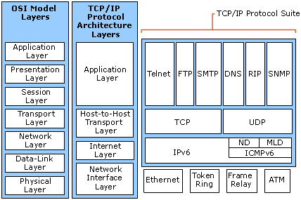

<!--
$theme: gaia
template: gaia
-->


Node.js基础
六、网络编程<p style="text-align:right;font-size:28px;margin-right:50px;color:#cFc;">:star: by calidion</p>
===
---
Node.js的优势能力
===
Node.js让网络开发变的非常容易
让很多原来必须使用C++开发的项目有机会通过Node.js来实现。
Node.js编写网络应用的优势主要是在它简化了网络连接与管理的代码

---
网络基础知识
===
1. TCP/IP协议(互联网的基础设施）



2. [Socket](https://en.wikipedia.org/wiki/Network_socket)
3. IO模型([select](http://pubs.opengroup.org/onlinepubs/007908799/xsh/select.html), [poll](http://pubs.opengroup.org/onlinepubs/007908799/xsh/poll.html), [epoll](http://man7.org/linux/man-pages/man7/epoll.7.html), [Kqueue](https://en.wikipedia.org/wiki/Kqueue), [IOCP](http://msdn.microsoft.com/en-us/library/aa365198%28VS.85%29.aspx))
---
Socket
===
1. 是一种连接方式
2. 基于IP+PORT

Socket编程
===
1. 是指基于IP+PORT的方式进行编程的方式
2. 典型的Socket编程：TCP/UDP
3. TCP/UDP之上的编程也都是Socket编程
---

网络编程基础--IO模型
===
1. select/poll
一种轮询检查IO的机制
select来自BSD分支
poll来自AT & T分支

2. epoll/kqueue
基于事件的IO机制，不再轮询，提高了效率
epoll是Linux的模型
kqueue是BSD的模型，包括Darwin

3. IOCP
多线程异步IO模型, 事先会创建线程池用于请求的处理,是Windows平台的

---
libuv
===
1. 是Cross-platform asynchronous I/O，即libuv是将不同的平台接口进行统一，并提供一致的接口给上层，屏蔽OS系统造成的差异
3. Node.js使用libuv在不同的平台采用最高效的IO模型（包括epoll, IOCP, kqueue)
4. libuv最初是给Node.js开发使用的

---
select/poll的问题
===
1. 最大并发数限制
一个进程的并发数受限（FD_SIZE = 1024）
修改FD_SIZE无法改善
2. 效率问题
每次扫描所有的FD
连接越多，速度越慢
3. 内存拷贝
用户态与核态互拷数据
4. poll
取消了并发数限制，但是没有解决其它2个问题

---
异步与同步、阻塞与非阻塞
===
1. 异步与同步主要是相对于代码来讲的
2. 阻塞与非阻塞主要是相对于进程/线程来讲的
3. `异步/同步/阻塞/非阻塞IO`实际上是相对于IO调用来讲的
当IO调用会阻塞/非阻塞线程时，那么这个IO就是阻塞/非阻塞IO
当IO调用会导致代码同步/异步时，那么这个IO就是同步/异步IO

---
关系表
===

| 代码 |  线程/进程 |
| :---: | :---: |
| 同步 |  阻塞 | 
| 异步 |非阻塞 |

---
阻塞IO与非阻塞IO
===
1. 阻塞IO


---

2. 非阻塞IO


---

3. 异步IO


---
IO模型对比
===


---
异步编程与异步IO的关系
===
1. 异步编程是基于异步调用的
2. 代码的异步调用的原因可以是
a. 进程性的异步（setImmediate)
b. 定时器引起的异步(setTimeout)
c. 异步IO引起的异步(socket编程)
3. 以上形式都可以导致异步调用，但是不一定是在语言层面上就是异步的

---
异步IO与Node.js的结合
===
1. javascript在是事件驱动的语言
2. javascript语言本身并没有多线程机制
3. javascript的事件回调函数机制非常成熟
4. 异步+单线程有一些明显的好处
减少了线程切换成本
避免了等待
有更高的效率

---
Node.js网络编程
===
1. 支持协议
a. tcp
b. udp
c. http

2. 理解无连接/有连接
a. 有连接是指链跟建立需要又方确认, tcp以及tcp之上的协议都是有连接的协议
b. 无连接是指建立链接不需要确认，udp协议属于这类协议

---

3. 理解有状态与无状态
a. 有状态是指链接成功后，链接双方一直维护相互的用户状态(tcp)
```
  request1(unknown)
 A ---> B
  request2(know)
 A ---> B
```
b. 无状态是指链接成功后，链接双方不能直接通过链接本身识别双方(http)
```
  request1(unknown)
 A ---> B
  request2(unknown)
 A ---> B
```

---
创建TCP服务器
===
1. 引入net包
```
const net = require("net");
```
2. 创建服务器
```
const server = net.createServer((socket) => {
  socket.end('Hello from tcp server!\n');
});
```
---

3. 侦听端口
```
server.listen(process.env.NODE_PORT || 8888);
```
其中： 
net包提供了基本的TCP接口包
net.createServer创建一个net.Server类的对象
使用listen方法侦听端口

---
net.Server 类
===
1. 用于创建TCP/IPC服务器
```
new net.Server([options][, connectionListener])
//或者
net.createServer([options][, connectionListener])
```
2.可能响应的事件：
a. connection：外部socket接入事件
b. listening: 侦听事件
c. close: 关闭事件
d. error: 错误事件

---
connection事件
===

```
const net = require("net");

const server = net.createServer((socket) => {
});

server.on("connection", (socket) => {
    // 无id
    console.log("socket id = " + socket.id);
    console.log("new socket is coming");
});

server.listen(process.env.NODE_PORT || 8888);
```

---
listening事件
===
```
server.on("listening", () => {
        console.log("server is listening");
        console.log(arguments);
});
```

比listen的回调优先级高。

error事件
===
```
server.on('error', (err) => {
  // handle errors here
  throw err;
});
```
---
close事件
===
会在所有连接关闭后发出
```
server.on('close', (err) => {
console.log("server is closed!");
});
```
---
net.Socket 类
===
1. 获取远程地址与端口
.remoteAddress
.remotePort

2. 取消TCP缓存数据(Nagle算法)
.setNoDelay

3. 发送数据
.write


---
net.Socket 重要事件
===
1. data
表示有数据进入

2. end
表示数据传输完成


3. 其它事件error, connect, close

---

创建UDP服务器
===
1. 引入dgram包
```
const dgram = require('dgram');
```
2. 创建udp服务器
```
const server = dgram.createSocket('udp4');
```
3. 创建message事件的接收器

```
server.on('message', (msg, rinfo) => {
  console.log(`server got: ${msg} from ${rinfo.address}:${rinfo.port}`);
});
```
---
4. 设置侦听事件的响应

```
server.on('listening', () => {
  const address = server.address();
  console.log(`server listening ${address.address}:${address.port}`);
});
```

4. 绑定到端口上

```
server.bind(4333);

```
完成。

---
创建UDP客户端
===
1. 引入dgram包
```
const dgram = require('dgram');
```
2. 创建udp服务器
```
const client = dgram.createSocket('udp4');
```
3. 发送消息
```
const message = Buffer.from('Udp 客户端请求');
client.send(message, 4333, 'localhost', (err) => {
  client.close();
});
```
---
UDP收发消息
===
1. 服务器发消息
```
server.send("message '" + msg + "' received!", 
rinfo.port, rinfo.address);
```
2. 客户端收消息

```
client.on("message", (msg, rinfo) => {
	console.log(`client got: ${msg} from ${rinfo.address}:${rinfo.port}`);
	console.log("message from server, received");
	console.log("message is" + msg);
	client.close();
});
```
---
HTTP服务器
===
1. 引入http包
```
const http = require('http');
```
2. 创建服务器
```
const server = http.createServer((req, res) => {
  res.end("Hello world!\n");
});
```

3. 侦听端口
```
server.listen(4333);
```
---
访问测试
===
```
$> curl http://127.0.0.1:4333
Hello world!
```
最简单的HTTP服务器完成！

下面命令可以看到协议的一些交互信息：

```
curl -v http://127.0.0.1:4333
```


